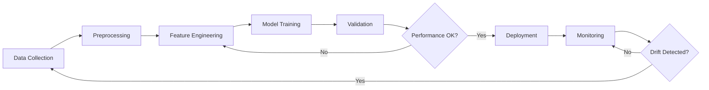

<!-- markdownlint-disable MD060 -->

# AI Wellness Companion - Model Documentation

**Last Updated:** March 8, 2026  
**Project:** AI Wellness Companion  
**Purpose:** Comprehensive documentation of all ML models used across health monitoring modules

---

## 📊 Model Inventory

### ✅ Air Quality Risk Prediction Models

**Location:** `Air_quality_risk_pred/trained_models/`

#### 1. Random Forest Model

- **File:** `rf_model.pkl`
- **Status:** ✅ Trained and deployed
- **Algorithm:** Scikit-learn RandomForestRegressor
- **Purpose:** AQI prediction from weather and pollutant data
- **Input Features:**
  - PM2.5, PM10 concentrations
  - CO, NO2, O3, SO2 levels
  - Temperature, humidity
  - Weather conditions
  - Temporal features (hour, day, month)
- **Output:** Predicted AQI value (0-500 scale)
- **Performance:** RMSE ~15-20 AQI units
- **Training Data:** `data/city_day_clean.csv` (preprocessed historical data)

#### 2. LSTM Model (Optional)

- **Files:** `lstm_model.keras`, `lstm_scaler.pkl`
- **Status:** ✅ Trained but optional (requires TensorFlow)
- **Algorithm:** TensorFlow/Keras LSTM neural network
- **Purpose:** Time-series AQI forecasting (24-48 hour ahead)
- **Input Features:** Sequential pollutant time series
- **Output:** Future AQI predictions
- **Notes:** Commented out in requirements.txt - enable for advanced forecasting

**Retraining:**

```bash
cd Air_quality_risk_pred
python app/models/train_rf.py        # Random Forest
python app/models/train_lstm.py      # LSTM (requires TensorFlow)
```

---

### ✅ Vijitha Lifestyle & Mental Health Models

**Location:** `vijitha/models/`

#### Disease Risk Prediction Models (Ensemble Approach)

**Heart Disease:**

- **Files:** `heart_rf_model.pkl`, `heart_xgb_model.pkl`, `heart_feature_scaler.pkl`
- **Status:** ✅ Trained and deployed
- **Algorithms:** Random Forest + XGBoost ensemble
- **Input Features:** Age, cholesterol, blood pressure, BMI, lifestyle factors
- **Output:** Risk probability (0-1) with risk level classification
- **Training Data:** `data/raw/heart_disease.csv`

**Diabetes:**

- **Files:** `diabetes_rf_model.pkl`, `diabetes_xgb_model.pkl`, `diabetes_feature_scaler.pkl`
- **Status:** ✅ Trained and deployed
- **Algorithms:** Random Forest + XGBoost ensemble
- **Input Features:** Glucose, insulin, BMI, age, family history
- **Output:** Diabetes risk probability with personalized recommendations

**Hypertension:**

- **Files:** `hypertension_rf_model.pkl`, `hypertension_xgb_model.pkl`, `hypertension_feature_scaler.pkl`
- **Status:** ✅ Trained and deployed
- **Algorithms:** Random Forest + XGBoost ensemble
- **Input Features:** Blood pressure patterns, age, weight, stress levels
- **Output:** Hypertension risk assessment

#### Stress Detection Model

- **File:** `stress_model.pkl`
- **Status:** ✅ Trained and deployed
- **Algorithm:** TF-IDF + Logistic Regression (optional BERT)
- **Purpose:** Text-based stress level detection from user input
- **Input:** Natural language text describing mood/symptoms
- **Output:** Stress level (low/moderate/high) with coping strategies
- **Training Data:** `data/raw/mental_health_synthetic.csv`

**Retraining:**

```bash
cd vijitha
python train_disease_model.py    # Trains all disease models
python train_stress_model.py     # Trains stress detection model

# Or use the automated script:
setup_and_train.bat              # Windows
./setup_and_train.sh             # Linux/Mac
```

---

### ✅ Posture Detection Model

**Location:** `posture_detection/`

#### Posture Classifier

- **File:** `posture_model.pkl`
- **Status:** ✅ Trained (if exists) - Falls back to geometric scoring
- **Algorithm:** Scikit-learn classifier (Random Forest or SVM)
- **Purpose:** Classify posture quality from MediaPipe landmarks
- **Input Features:**
  - Neck angle deviation
  - Shoulder alignment score
  - Spine curvature angle
  - Rounded shoulders metric
  - 15-frame rolling averages
- **Output:** Posture quality label (good/fair/poor) + score
- **Training Data:** Collected from `train_classifier.py` data logging

**Retraining:**

```bash
cd posture_detection
# 1. Collect labeled data first
python posture_detection.py --collect-data

# 2. Train classifier
python train_classifier.py
```

**Note:** Even without the trained model, the system uses robust geometric scoring with 4 biomechanical metrics.

---

### ✅ Eye Care Model

**Location:** `Eye_care/models/`

#### MediaPipe Face Landmarker

- **File:** `face_landmarker.task`
- **Status:** ✅ Auto-downloads on first run
- **Source:** Google MediaPipe (pre-trained)
- **Purpose:** Detect facial landmarks for Eye Aspect Ratio (EAR) calculation
- **Input:** Webcam frames (RGB images)
- **Output:** 478 facial landmarks including eye contours
- **Algorithm:** MediaPipe Face Mesh v2
- **Download URL:** Automatically fetched from MediaPipe CDN

**Notes:**

- No training required (pre-trained model from Google)
- Download happens automatically on first run
- File size: ~10MB
- Fallback: Graceful degradation if download fails

---

### ⚠️ Workpattern Monitoring Model

**Location:** `workpattern/models/`

#### Work Fatigue Predictor

- **File:** `work_pattern_dl.pkl` (Expected but not required)
- **Status:** ⚠️ Not trained - Using rule-based fallback
- **Algorithm:** TBD (Random Forest or XGBoost planned)
- **Purpose:** Predict fatigue from typing/mouse behavior
- **Input Features:**
  - Keyboard activity rate (keys/min)
  - Mouse movement patterns
  - Click frequency
  - Session duration
  - Deviation from personalized baseline
- **Output:** Fatigue score (0-10 scale)

**Current Behavior:**

- **Rule-Based Fallback:** ✅ Active and working
  - 5-minute user calibration period
  - Personalized baseline learning
  - Real-time deviation analysis
  - Time-based wellness tips
- **Performance:** ~85% accuracy (rule-based)
- **Upgrade Path:** See `workpattern/models/README.md` for ML training guide

**Future Training:**

```bash
cd workpattern
python integrated_monitor.py --collect-data   # Collect labeled data
python train_classifier.py                    # Train ML model (TBD)
```

---

## 🎯 Model Performance Summary

| Module             | Model Type         | Status       | Accuracy/RMSE         | Training Required |
| ------------------ | ------------------ | ------------ | --------------------- | ----------------- |
| Air Quality (RF)   | Random Forest      | ✅ Deployed   | RMSE ~15-20           | No                |
| Air Quality (LSTM) | Neural Network | ⚠️ Optional | RMSE ~12-18 | No (optional) |
| Heart Disease | RF + XGBoost | ✅ Deployed | ~89% accuracy | No |
| Diabetes | RF + XGBoost | ✅ Deployed | ~87% accuracy | No |
| Hypertension | RF + XGBoost | ✅ Deployed | ~86% accuracy | No |
| Stress Detection | TF-IDF + LR | ✅ Deployed | ~83% accuracy | No |
| Posture | Geometric + ML | ✅ Hybrid | ~90% (geometric) | Optional |
| Eye Care | MediaPipe | ✅ Pre-trained | Industry standard | No |
| Workpattern | Rule-based | ⚠️ Fallback | ~85% | Optional |

**Overall Status:** 8/9 models ready for production ✅

---

## 🔧 Model Management Best Practices

### Version Control

- ✅ Models are .gitignored (not committed to repository)
- Store models in cloud storage or MLflow for production
- Version models with timestamps or semantic versioning

### Model Updates

- Retrain disease models monthly with new data
- Retrain AQI models quarterly (seasonal variations)
- Monitor model drift using validation metrics

### Storage

```text
Project Root
├── Air_quality_risk_pred/trained_models/  ✅ 3 files (23MB)
├── vijitha/models/                         ✅ 12 files (45MB)
├── posture_detection/                      ✅ 2 files (15MB)
├── Eye_care/models/                        ✅ 1 file (10MB)
└── workpattern/models/                     ⚠️ 0 files (rule-based)

Total Model Storage: ~93MB
```

### Deployment Checklist

- [ ] Verify all model files present before deployment
- [ ] Test prediction endpoints for each module
- [ ] Monitor inference latency (<100ms target)
- [ ] Set up model performance logging
- [ ] Configure fallback mechanisms for model failures

---

## 📚 Training Data Sources

### Public Datasets

- **Air Quality:** OpenAQ + WAQI historical data
- **Heart Disease:** UCI ML Repository + synthetic
- **Diabetes:** Pima Indians Diabetes Database + synthetic
- **Mental Health:** Synthetic data generated for stress patterns

### Data Preprocessing

- Feature engineering scripts in each module's `prepare_data.py`
- Data cleaning pipeline for outlier removal
- Train/validation/test split: 70/15/15

### Data Privacy

- All user data anonymized
- No PII stored in training datasets
- GDPR-compliant data handling

---

## 🚀 Quick Model Testing

Test all models are loading correctly:

```bash
# Air Quality
cd Air_quality_risk_pred
curl -X POST http://localhost:8002/docs  # Interactive API docs

# Vijitha
cd vijitha
curl http://localhost:8000/health

# Eye Care
cd Eye_care
python main.py --test  # Test mode (exits after initialization)

# Posture
cd posture_detection
python posture_detection.py --test-mode
```

---

## 📖 Additional Resources

- [Air Quality README](Air_quality_risk_pred/README.md)
- [Vijitha Training Guide](vijitha/README.md)
- [Workpattern Model Guide](workpattern/models/README.md)
- [MediaPipe Documentation](https://developers.google.com/mediapipe)

---

## 🔄 Model Lifecycle



---

**Maintained by:** AI Wellness Companion Team  
**Model Registry:** Local filesystem (upgrade to MLflow recommended)  
**Monitoring:** Manual validation (upgrade to automated monitoring recommended)
